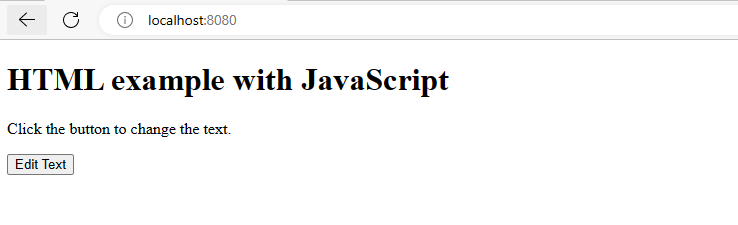
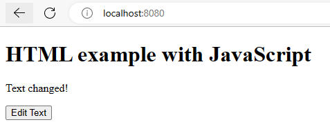

Был создан файл _index.html_, который меняет выводимый текст при нажатии на кнопку. Он выглядит следующим образом:

```
<!DOCTYPE html>
<html>
<head> 
  
  <title>HTML example with JavaScript</title>
</head>
<body>
  
  <h1>HTML example with JavaScript</h1>

  <p id="demo">Click the button to change the text.</p>

  <button onclick="changeText()">Edit Text</button>

  <script>
    function changeText() {
      var element = document.getElementById("demo");
      element.innerHTML = "Text changed!";
    }
  </script>

</body>
</html>
```
 для него создан Dockerfile 
```

FROM nginx

COPY . /usr/share/nginx/html

WORKDIR /usr/share/nginx/html

EXPOSE 80

CMD ["nginx", "-g", "daemon off;"]

```
И так, перейдем в папку, где находятся 
этот докерфайл и файл с кодом html _index.html_. запустим этот Dockerfile созданием образа с именем __obraz__ `docker build -t obraz .`
Запустим контейнер от созданного образа obraz с помощью _docker run_ и результат передадим на порт 8080

``` 
docker run --name nginxx -d -p 8080:80 obraz
```

Вот, что мы видим при переходе на Localhost:8080



А при нажатии на кнопку получим:


