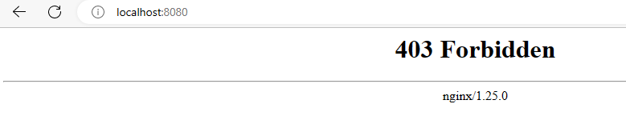
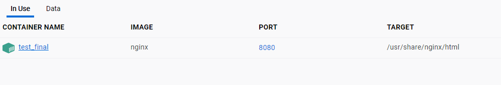
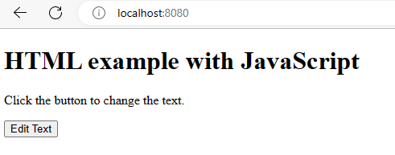
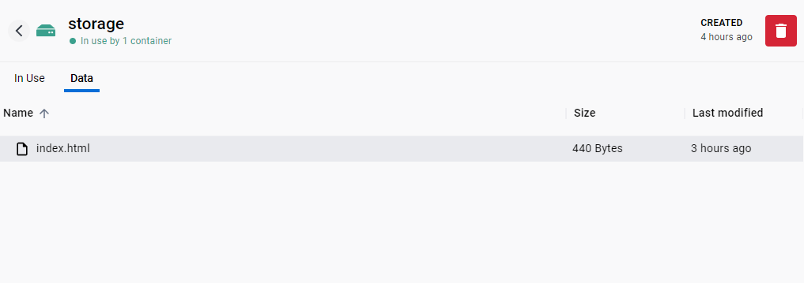
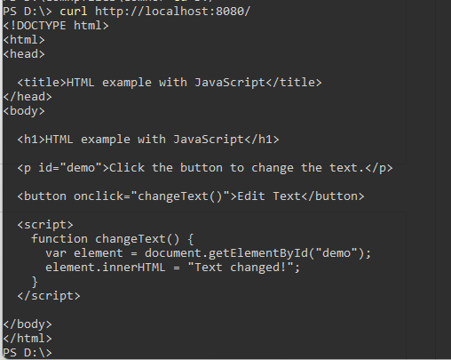

___шаг 1.___ 

 Для выполнения первого задания из лабораторной работы №5 в проекте из лаб работы №4 я запускал контейнер командой

```
docker run -d -v volumeC:/usr/share/nginx/html --name test obraz
 ```

 где test - имя собранного образа
 
 если проинспектируем контейнер test `docker container inspect test` получим:
```
 "Mounts": [
            {
                "Type": "volume",
                "Name": "volumeC",
                "Source": "/var/lib/docker/volumes/volumeC/_data",
                "Destination": "/usr/share/nginx/html",
                "Driver": "local",
                "Mode": "z",
                "RW": true,
                "Propagation": ""
            }
        ]
```
___шаг 2.___
docker pull postgres
```
 docker run --name mySQL -v SQLdata:/var/lib/postgresql/data -e POSTGRES_PASSWORD=1234 -p 5432:5432 -d postgres
 docker exec -it mySQL bash  
 psql -U postgres
```
    CREATE DATABASE mydatabase;
    \c mydatabase;
        CREATE TABLE tabPlayers (id INT, name VARCHAR(50), number INT);
        INSERT INTO tabPlayers VALUES (1, 'John', 4), (2, 'Mary', 5), (3, 'Tom', 2);
        CREATE TABLE Years (id INT, age INT);
        INSERT INTO Years VALUES (1, 25), (2, 30), (3, 40);
Чтобы выйти в привычную рабочую директорию, нужно два раза прописать exit или ctrl+q

___шаг 3.___

Проверим Dockerfile из 12 примера. Создадим папку, туда добавим файл Dockerfile и файл index.html, в который запишем некоторый текст

После чего создим образ докерфайла командой `docker build . `
и запустим `docker run -d -p 8080:80 --name my_ng  dbc25d4bb6d0`

Так как мы не указывали имя для образа через опцию __-t__, нам нужно использовать id только что созданного нами образа. Этим id и является dbc25d4bb6d0.


потом инспектируем: 

`docker inspect my-ng`

находим графу "Volumes"
```
 "Volumes": {
                "/usr/share/nginx/html": {}
            },
```

Вывод таков. Хоть мы и не прописывали volume командой, он был прописан в докер файле с сылкой на html файл nginx. Поэтому в готовом контейнере мы получили уже готовый volume.

___шаг 4.___

Выполним пример 6 из методической части для nginx:

Создадим Volume `docker volume create --name storage `

Далее запустим контейнер с образом nginx, прикрутим наш volume storage к папке nginx и соединим порт nginx с портом 8080:

`run --name test_final -d -v storage:/usr/share/nginx/html -p 8080:80 5d38e233ecb9`

При открытии localhost:8080 видим, что выдается ошибка.



это потому что в нашем volume нет сохраненной информации, т.е., допустим, в Docker Desktop вкладка Data пустая. 



Поэтому давайте пробросим в наш storage наш html файл, созданный ранее с кнопкой замены текста:

```
docker cp ./index.html test_final:/usr/share/nginx/html
```
Так как к nginx мы прикрутили volume, код из index.html пойдет именно в него. Давайте теперь проверим localhost:8080





Далее создадим в нашей папке, файл __nginx.conf__ и скопируем в него конфигурационный файл nginx 

```
docker cp nginx.conf test_final:/etc/nginx/nginx.conf
```

Здесь test_final - название контейнера, который мы создали выше.

Посмотрим теперь содержимое data у storage




Если проверять работоспособность программы с помощью `curl http://localhost:8080/`. Получим код из загруженного в наш volume файла index.html. Т.е.




Не забываем, чтобы внести исменения в контейнер, его нужно выключить.