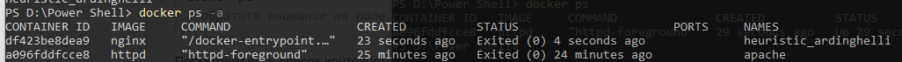
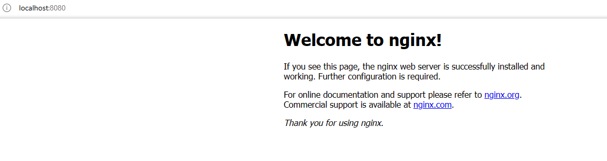

__Выполнил Киселев В.Ю.
ИВТо-211__</p>
__Отчет
По лабораторной работе №2 Мобильные системы__
С помощью _docker pull_ установлены образы _nginx_ и _apache_ (httpd):
`docker run --name apache httpd`
`docker run -d nginx`



С помощью `docker ps` увидим, что два контейнера запущены, а с помощью `docker images` увидим установленные образы _nginx, httpd_.

Остановим эти контейнеры
`docker stop df423be8dea9 apache`
где _df423be8dea9_ – id контейнера _nginx_

Удалим созданные контейнеры с помощью _docker rm_
`docker rm df423be8dea9 apache`
И проверим, что они действительно удалились
`docker ps –a`
удалим образ с nginx
`docker rmi nginx`
Проверим `docker images`, что образ удалился

После чего создадим контейнер proxy, который откроется в детач режиме, настроим ему маппинг с 8080 на 80 порт, на котором работет _nginx_ по умолчанию.
`docker container run -d -p 8080:80 --name proxy nginx`



`docker run -d -p 8082 --name rabota httpd`


Теперь 8080 и 8082 порты заняты, если захотим создать еще один контейнер, то нужно будет использовать другой порт, например, 8081, передавать его так же на 80 и изменить имя.

Далее удалим наш контейнер proxy с помощью того же `docker rm` и создадим новый контейнер proxy, который будет рестартиться, если выскочит ошибка
`docker container run -d -p 8080:80 --name proxy --restart on-failure nginx`
и создадим контейнер proxy1, который удалится самостоятельно сразу после остановки контейнера. Для этого используется ключ _--rm_, примаппим proxy1 в 8081 порту
`docker container run -d -p 8081:80 --name proxy1 --rm nginx`
Если откроем `docker ps`, то, и proxy, и proxy1 будут выведенными как запущенные.

Исследуем данные _ID, PORT_ у контейнера proxy. Для этого _docker inspect_ используем ключ _--format_
`docker inspect proxy --format "ID:{{.Id}} | PORT:{{.NetworkSettings.Ports}}"`

Переименуем контейнер proxy2 на nginx
`docker rename proxy1 nginx`
Проверяем с помощью _docker ps_. Посмотрим размер контейнера nginx `docker ps –as` 1.09kB (virtual 142MB) а после сделаем
`docker exec -it nginx bash`
Там напишем /# `apt update && apt upgrade`
Получим 18MB (virtual 160MB) размер контейнера очень сильно увеличился.

Посмотрим установленные образы `docker images` и установим _alpine: 2.6, alpine 3.7_. Введем `docker images alpine`
Вывод выглядит так:
```
alpine       3.7       6d1ef012b567   4 years ago   4.21MB
alpine       2.6       e738dfbe7a10   7 years ago   4.5MB
```
Теперь скачаем пользовательский образ _nginx_ и отправим его к себе на _dockerhub_
`docker image pull fholzer/nginx-brotli`
Получим информацию о его слоях
`docker image history fholzer/nginx-brotli`
Создаём копию образа и пушим ее в dockerhub
`docker image tag fholzer/nginx-brotli logiea/brotli`
`docker image push logiea/brotli`</p>
остановим и удалим контейнеры nginx, proxy, proxy1 с помощью `docker container prune`.
Изменим стартовую страницу _nginx_ и _apache_. Для этого воспользуемся программой _VS Code_. Нужно написать какую-нибудь простенькую страницу на html и передать эту папку внутрь папок _nginx_ и _apache_ с помощью передачи томов ___–v___.
Для nginx создадим папку и поместим туда файл html и пропишем такой код

```

<!DOCTYPE html>
<html lang="en">
<head>
    <meta charset="UTF-8">
    <meta http-equiv="X-UA-Compatible" content="IE=edge">
    <meta name="viewport" content="width=device-width, initial-scale=1.0">
    <title>apache</title>
</head>
<body>
    <h1>Приветствую на главной странице apache</h1>
</body>
</html>

```

Тут использаем папку ___/usr/share/nginx/html___ образа _nginx_. Далее в терминале перейдем в папку, где этот файл находится и напишем
`docker run -v ${PWD}:/usr/share/nginx/html -p 8080:80 -d --name nginx nginx`
Попробуем зайти localhost:8080
Выводится текст, который мы написали 
>Приветствую на главной странице nginx


Далее создаем папку для apache и пишем такой код

```

<!DOCTYPE html>
<html lang="en">
<head>
    <meta charset="UTF-8">
    <meta http-equiv="X-UA-Compatible" content="IE=edge">
    <meta name="viewport" content="width=device-width, initial-scale=1.0">
    <title>apache</title>
</head>
<body>
    <h1>Приветствую на главной странице apache</h1>
</body>
</html>

```

Тут используем папку ___/usr/local/apache2/htdocs/___
Образа _httpd_ и пробрасываем туда нашу папку с кодом выше вот так
`docker run -v ${PWD}:/usr/local/apache2/htdocs/ -d --name apache -p 8080:80 httpd`
и, пробуем зайти на localhost:8080. Нам выдает измененную страничку html. 
>Приветствую на главной странице apache


Задание выполнено.

[Вверх](#anchor)