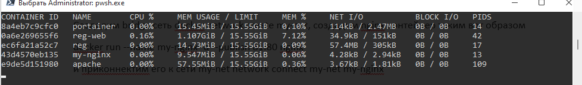
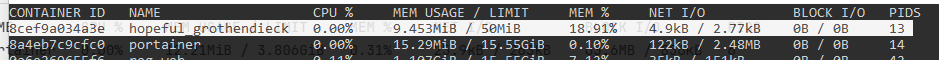
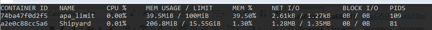

__Выполнил Киселев В.Ю.
ИВТо-211__</p>
__Отчет
По лабораторной работе №3 Мобильные системы__

Создадим _bridge_ сеть `docker network create my-net`, создадим nginx контейнер таким вот образом
`docker run --name my-nginx -d --publish 81:80 nginx `
и приконнектим его к сети `my-net network connect my-net my-nginx`
Проинспектируем сеть `docker network inspect my-net`, а затем отсоединим от сети контейнер и снова проинспектируем сеть. Увидим, что там, где была информация от контейнерах, теперь пусто. 

Создадим контейнер в детач режиме, который пробрасывает 5000 порт, а при выключении рестартует.
`docker run -d -p 5000:5000 --restart always --name reg registry:2`
Подключим _ui_ интерфейс и зайдем на localhost:8081, видим там регистр. Добавим в регистр новый тег для nginx `docker image tag nginx localhost:5000/nginx:v1` и запушим его в локальный registry `docker push localhost:5000/nginx:v1`
Далее установим _Portainer_ _portainer/portainer-ce_, затем выполним команду
`docker run -d -p 9000:9000 --restart always -v "/var/run/docker.sock:/var/run/docker.sock" --name portainer portainer/portainer-ce`
После чего у нас на localhost:9000 будет открываться _Portainer_.
Выполним команду `docker stats`. Мы увидим информацию о контейнерах и использовании ими отведенной им памяти. 


Поставим лимит на память и процессор `docker run -d -p 8083:80 -m 50m --cpus 1 --name ng_limit nginx`


####Практические задания:<p>
Останавливаем все контейнеры `docker stop $(docker ps -a -q)`, кроме _Portainer_, удаляем их `docker container rm $(docker ps -a -q)`, удаляем все образы `docker image prune -a`, диски `docker volume rm $(docker volume ls -q)` и неиспользуемые сети. Удалить все ненужное `docker system prune –a`. Устанавливаем _docker registry_(`docker run -d --name registry-ui -p 8080:80 jc21/registry-ui`), _Shipyard_. Я нашел в интернете инструкцию по ручной установке _Shipyard_

```

docker run -ti -d --restart=always --name shipyard-rethinkdb -p 49153:8080 rethinkdb
docker run -ti -d -p 4001:4001 -p 7001:7001 --restart=always --name shipyard-discovery microbox/etcd -name discovery
docker run -ti -d -p 2375:2375 --hostname=docker-api --restart=always --name shipyard-proxy -v /var/run/docker.sock:/var/run/docker.sock -e PORT=2375 shipyard/docker-proxy:latest
docker run -ti -d --restart=always --name shipyard-swarm-manager swarm:latest manage --host tcp://0.0.0.0:3375 etcd://10.10.10.11:4001
docker run -ti -d --restart=always --name shipyard-swarm-agent swarm:latest join --addr 10.10.10.11:2375 etcd://10.10.10.11:4001
docker run -ti -d --restart=always --name shipyard-controller --link shipyard-rethinkdb:rethinkdb --link shipyard-swarm-manager:swarm -p 8080:8080 shipyard/shipyard:latest server -d tcp://swarm:3375

```

После этого я открыл 8080 localhost, зашел в аккаунт Логин по умолчанию - _admin_, а пароль – _shipyard_.

Установим лимит на контейнер apache
Для начала заново его запуллим `docker pull httpd`, а затем установим лимиты на память и процессор `docker run -d -p 8080:80 -m 100m --cpus 3 --name apa_limit httpd`
Проверим

